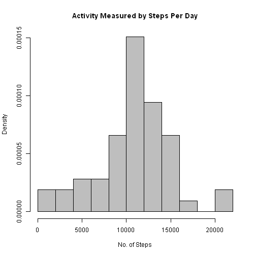
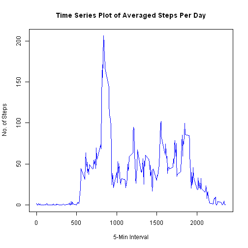
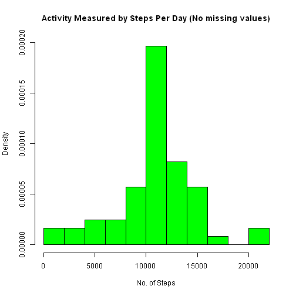
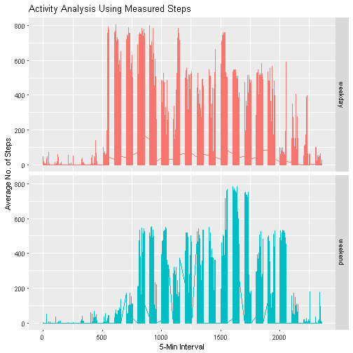

### Description

This markdown documents the code for the analysis of an activity monitoring dataset consisting of 3 variables:
1. steps - Number of steps taking in a 5-minute interval (missing values are coded as NA)
2. interval - The date on which the measurement was taken in YYYY-MM-DD format
3. date - Identifier for the 5-minute interval in which measurement was taken

### Loading and preprocessing the data
1. The dataset, activity.csv, is read in R, using the read.csv2 function. Reviewed the data using the str() and summary() functions which show 17,568 obs and 2,304 missing values.


```r
activity <- read.csv2("activity.csv", header = TRUE, sep = ",")
```

```
## Warning in file(file, "rt"): cannot open file 'activity.csv': No such file
## or directory
```

```
## Error in file(file, "rt"): cannot open the connection
```

```r
str(activity)
```

```
## 'data.frame':	17568 obs. of  3 variables:
##  $ steps   : int  NA NA NA NA NA NA NA NA NA NA ...
##  $ date    : Date, format: "2012-10-01" "2012-10-01" ...
##  $ interval: int  0 5 10 15 20 25 30 35 40 45 ...
```

```r
summary(activity)
```

```
##      steps             date               interval     
##  Min.   :  0.00   Min.   :2012-10-01   Min.   :   0.0  
##  1st Qu.:  0.00   1st Qu.:2012-10-16   1st Qu.: 588.8  
##  Median :  0.00   Median :2012-10-31   Median :1177.5  
##  Mean   : 37.38   Mean   :2012-10-31   Mean   :1177.5  
##  3rd Qu.: 12.00   3rd Qu.:2012-11-15   3rd Qu.:1766.2  
##  Max.   :806.00   Max.   :2012-11-30   Max.   :2355.0  
##  NA's   :2304
```

2. Packages/libraries are installed to assist with processing the data, 
- library(dplyr),
- library(ggplot2),
- library(reshape),
- library(sqldf)


3. The variable date is transformed from factor to date.


```r
activity$date <- as.Date(as.character(activity$date, format = "%y/%m/%d"))
```

### Calculation of the mean total number of steps taken per day
4. Missing values are ignored in calculating total number of steps taken per day, totalsteps_day.


```r
totalsteps_day <- activity %>% group_by(date) %>% summarize(tts = sum(steps))
```
5. Plot a histogram of the total number of steps taken per day, noting that the data included missing values.


```r
hist(totalsteps_day$tts,prob=T,breaks=10
     , main = "Activity Measured by Steps Per Day"
     , xlab = "No. of Steps", col = "gray")
```



6. The mean and median of the total number of steps taken per day are calculated.


```r
# Find the mean and median of the steps each day
summary(totalsteps_day$tts)
```

```
##    Min. 1st Qu.  Median    Mean 3rd Qu.    Max.    NA's 
##      41    8841   10760   10770   13290   21190       8
```

### Average Daily Pattern
7. To make the time-series plot, first, calculate the daily average steps per 5-minute interval and reshape the dataset.


```r
## Find daily average steps per interval
avgsteps <- aggregate(steps ~ interval, data = activity, mean)

## Reshape the data using melt function
df_melt <- melt(avgsteps, id = "interval")
```

8. Plot a line time-series of the 5-minute interval on the x-axis against the average number of steps taken, averaged across all days on y-axis.


```r
plot(df_melt$interval, df_melt$value, type = "l", xlab = "5-Min Interval", ylab = "No. of Steps", main = "Time Series Plot of Averaged Steps Per Day", col = "blue")
```



9. To find the specific 5-minute interval, on average across all the days in the dataset, the which() and length() are utilized.


```r
# find max number of steps
df_melt[which.max(df_melt$value),]
```

```
##     interval variable    value
## 104      835    steps 206.1698
```

### Imputing missing values
10. The dataset contained 2,304 missing values (NA), as derived from review of the data summary in step 1 above. The total missing values are calculated.


```r
length(which(is.na(activity)))
```

```
## [1] 2304
```

11. Having calculated the average number of steps taken during each 5-minute interval per day from step 7 above, it is then used to fill in for the missing values (NA) in the activity dataset.
12. The sqldf() function creates a new dataset, newdf, by replacing the missing value with the averaged steps in the select join query.


```r
newdf <- sqldf("select case when activity.steps IS NULL 
                         then df_melt.value 
                    else activity.steps end as steps, activity.date, activity.interval 
               from activity left join df_melt on activity.interval = df_melt.interval")
```

13. From the new dataset, newdf, the total number of steps, new_tsd, is calculated, but for this dataset, there are no missing values.


```r
new_tsd <- newdf %>% group_by(date) %>% summarize(new_tts = sum(steps))
```

14. A second histogram is plotted of the new dataset, which has no missing values, since the NAs were replaced by the calculated average steps taken per day, from step 7 above.


```r
hist(new_tsd$new_tts,prob=T,breaks=10
     , main = "Activity Measured by Steps Per Day (No missing values)"
     , xlab = "No. of Steps", col = "green", ylim = c(0,0.0002))
```



15. The mean and median are calculated in the new dataset and compared with the previous histogram. Between the two graphs, there is little difference. The complete (no NAs) dataset, newdf, has a very slightly higher density than the original, activity dataset but overall, the distribution including mean and median are not significantly much and both histograms show normal distributions.


```r
summary(new_tsd$new_tts)
```

```
##    Min. 1st Qu.  Median    Mean 3rd Qu.    Max. 
##      41    9819   10640   10750   12810   21190
```

### Differences in activity patterns between weekdays and weekends
16. Using weekdays() and the calculated average number of steps, from step 7 above, a new factor variable, wkday, with two levels, weekday and weekend, is added to the new dataset, finaldf.


```r
finaldf <- mutate(newdf, wkday = ifelse(weekdays(date) %in% c("Saturday","Sunday"), "weekend","weekday"))
```

17. Using ggplot2 package, a two-panel plot of the finaldf dataset, is produced which shows 1 row for each of the factor weekday and weekend by plotting the averaged steps taken daily per 5 minute interval. It shows that activity is consistently higher during the weekday than the weekend. It is presumed that people are actively walking around during their normal course of the work day starting at 500 steps (of the 5-minute intervals) but relatively relaxed in the weekends. There is a noticeable increase of the activity in the 1600 steps during the weekend which means that some people are also active, in some part of the day.


```r
g <- ggplot(finaldf, aes(interval, steps))
g + geom_line(aes(color = wkday)) + facet_grid(wkday~.) + labs(title = "Activity Analysis Using Measured Steps") + labs(x = "5-Min Interval", y = "Average No. of Steps") + theme(legend.position = "none")
```



*** End ***
